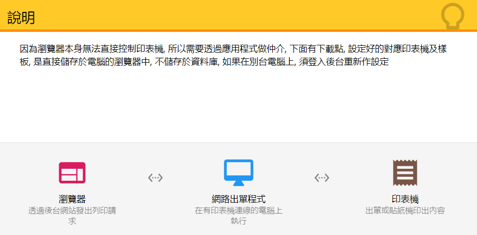

# ajax_printer
ajax_printer

Use AJAX for browser to print receipt

Query url

	GET http://127.0.0.1:35427/?q=list_printer
		RETURN Printers Information
		
	POST http://127.0.0.1:35427/?q=preview
		POST Xml struct
		RETURN png to display (only last page)
		
	POST http://127.0.0.1:35427/?q=print
		POST xml struct

XML struct

	<paper printer="{PRINTER}" copies="{COPIES}">
		<l c="set_font">Arial</l>
		<l c="set_size">6</l>
		
		<l c="padding_top">{PADDING_TOP}</l>
		<l c="padding_left">{PADDING_LEFT}</l>
		<l c="padding_right">{PADDING_RIGHT}</l>
		
		<l c="print" size="10">{NAME}</l>
		<l c="scroll_down">2</l>
		<l c="line">1</l>
		
		<l c="print_vt" x="84%" y="20%" align="left" font="Free 3 of 9" size="19">*{BARCODE}*</l>
		<l c="print_vt" x="94%" y="65%" align="left" font="Consolas" size="10">{BARCODE}</l>
		<l c="print_vt" x="94%" y="24%" align="left" font="Consolas" size="10">{PRICE}</l>
		
		<l c="scroll_down">3</l>
		<l c="fields">
			<f c="print" w="20%">111</f>
			<f c="print" w="60%">aaaaa</f>
		</l>
		<l c="fields">
			<f c="print" w="20%">222</f>
			<f c="print" w="60%">bbbbb</f>
		</l>
		<l c="fields">
			<f c="print" w="20%">333</f>
			<f c="print" w="60%">ccccc</f>
		</l>
		<l c="fields">
			<f c="print" w="20%">444</f>
			<f c="print" w="60%">ddddd</f>
		</l>
		
		<l c="print_xy" x="87%" y="3%" border="0.5">臺灣製</l>
		
		<l c="absolute_y">72%</l>
		<l c="line_w" begin="0%" end="80%">0.5</l>
		<l c="scroll_down">1</l>
		<l c="fields">
			<f c="print" w="20%">111</f>
			<f c="print" w="60%">aaaaa</f>
		</l>
		<l c="fields">
			<f c="print" w="20%">222</f>
			<f c="print" w="60%">bbbbb</f>
		</l>
		<l c="fields">
			<f c="print" w="20%">333</f>
			<f c="print" w="60%">ccccc</f>
		</l>
		<l c="fields">
			<f c="print" w="20%">444</f>
			<f c="print" w="60%">ddddd</f>
		</l>

		<l c="done" />
	</paper>

Command
